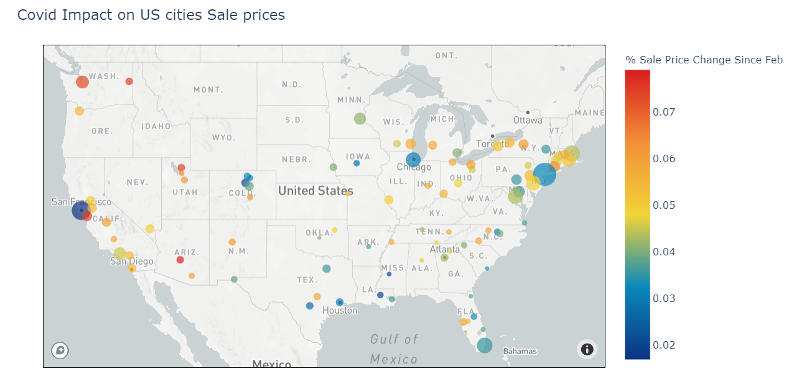
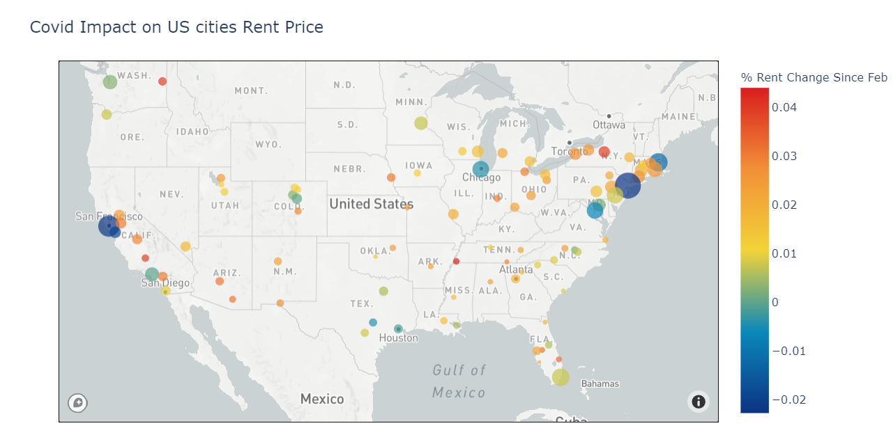
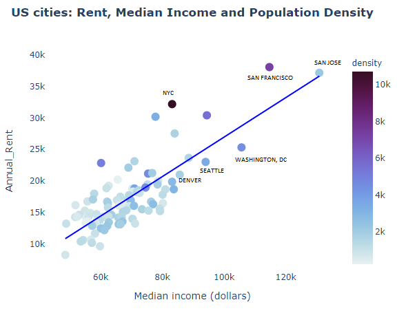
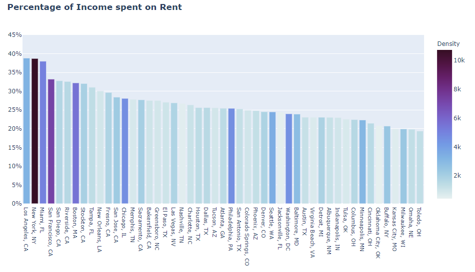
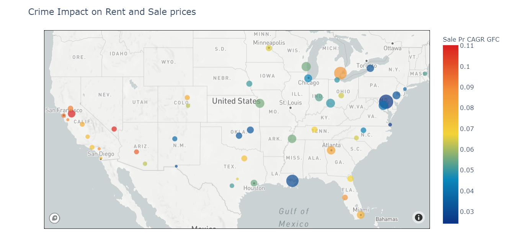
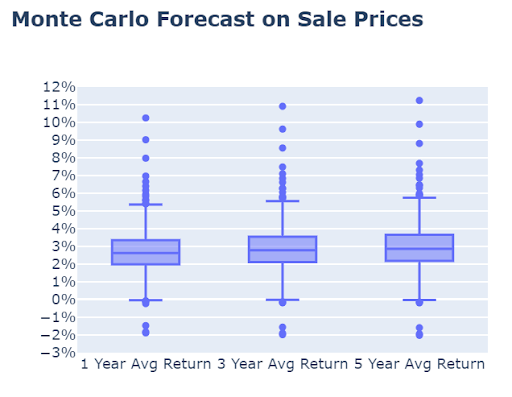
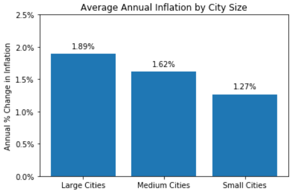
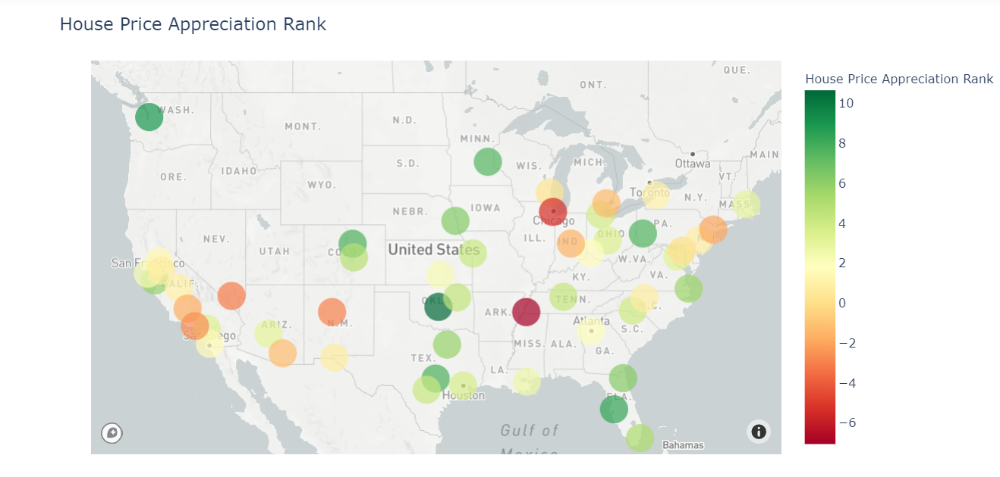
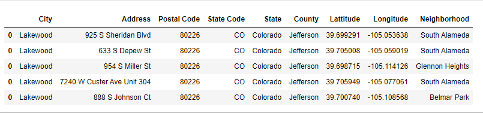
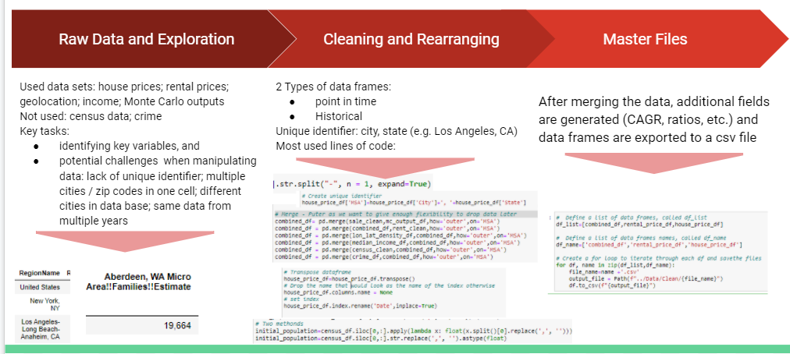

# Project 1: Housing Market Analysis
### Finding Attractive Real Estate Investment Opportunities

Code developed by Carlos Tacchi, Nika Chan, Alex Hall, Matthew Musgrave, and Eli Holden

### Table of contents
1. [Introduction](#Introduction)
2. [Analysis of Real Estate Investment Opportunities](#Analysis)
    - a. [COVID-19 and Sale Prices](#Sale)
    - b. [COVID-19 and Rent Prices](#Rent)
    - c. [Large Cities are Unaffordable](#Affordability)
    - d. [Crime is not always in the Big City](#Crime)
    - e. [Population Growth](#Population)
    - f. [Capital Appreciation](#Monte)
    - g. [A Note on Inflation](#Inflation)
3. [Where is the opportunity?](#Opportunity)
4. [Choose your own Adventure](#API)
5. [How to use this Dashboard](#Dashboard)
6. [Conclusions and What can be Improved](#Conclusion)
7. [All about Data](#Data)
    - a. [How we cleaned our data](#data_clean)
    - b. [Data sources](#data_source)
8. [Considerations for Grading](#Grading)
    - a. [Fulfillment of project requirements](#requirement)
    - b. [Who did what](#who)

## 1. Introduction 

This project is an analysis of post pandemic real estate investment opportunities in the US. Covid-19 hit the US in February 2020 and several states had to mandate lockdowns which forced people to spend much more time in their homes than ever before. The headlines say that people are moving away from cities and rethinking their long term housing requirements. We thought it would be a great idea to substantiate those claims, and create a dashboard that would help people analyze investment opportunities in the property market. The anlaysis was done using python programming and visualization techniques learned in class.

## 2. Analysis of Real Estate Investment Opportunities 

### a.The Impact of COVID on Sale Prices 

We used data from Zillow to look at the impact of COVID-19 on house prices. The image above shows each US metropolitan statistical area (also referred to as "MSA" for the rest of this document) in Zillow's database of housing prices. The size of each bubble corresponds to the population of the city and the color represents the change in house prices since February 2020. This visualization shows that big cities have seen a decrease in house prices while smaller cities surrounding those big cities have seen an increase in prices in the same period of time. This suggests that people have been moving from big dense cities to smaller cities and this is reflected in the price changes between these two categories since the pandemic began.

###### *Bubble size denotes population density (bigger bubble = higher density)*

### b. The Impact of COVID on Rental Prices 

Similar to the changes that we've seen in sale prices, COVID-19 has negatively impacted big city rental prices because of the changing living requirements. In non-pandemic times, big cities can offer attractive job opportunities alongside premium amenity properties, but with business closures and working from home policies, these are no longer the best options for renters. This has forced down the cost of renting in large cities while increasing the rental costs in suburban cities nearby. The current health crisis has also driven a higher price for housing as would be renters decide to buy a home instead of continuing to rent.

### c. Large Cities are Unaffordable 

We also looked at some factors that people would consider when deciding on buying or investing in real estate and one of the immediate factors that come to mind is affordability. This visualization shows each MSA's level of median income against its level of rent, while the color of the dot shows each city's density. We also included a simple regression line to show the positive relationship between income level and rent price and to give the viewer a better gauge of each city's standing against other cities. MSA's above the line are expensive while those below the line are affordable. We can see from here that big dense cities have higher levels of income, but also much higher levels of rent. 

Another way to look at the same variables was to divide median income by rental expense to see the percentage of income each city was spending on rent. Based on this metric, those that live in larger cities like NYC, LA and Miami pay almost 40% of their gross wages on housing while the smallest cities pay less than half of that and cities that are on the regression line spend approximately 25% of their income in rent. People who work in these large cities may choose to live further away to reduce their cost of living, especially if work from home policies continue. 

For these two visuals, we used annualized personal income data for each state from the US Bureau of Economic Analysis for 2019 and annualized rental data from zillow for the same time period. While we are aware that this data does not reflect income changes that might have happened during the pandemic, it is the most recent data that is available and still reflects general price levels in each state. 

### d. Crime is not always in cities 

Another factor we took into consideration was crime. We looked at FBI's data on violent crime per state and analyzed its impact on rent and sale prices. The plot below shows the compound annual growth rate (CAGR) of sale prices per state since the great financial crisis (GFC) by color and the size of each dot represents shows incidents of murder (the larger the dot, the more murder there is in that city). This graph shows a negative relationship between sales price growth and murder rate which is not surprising but should be considered when buying property. It also suggests that crime may not always be in big dense cities. The smaller cities might prove more affordable based on the previous section, but that affordability comes with a cost -- it might not be as safe.

*Size of Bubble is Murder Rate (Bigger Bubble = Higher Murder Rate)*

### e. Population Growth [This section is not yet done] 

Most of the U.S. population growth occurs in major cities because jobs tend to encourage people to live in the area and have families which creates the virtuous cycle of more jobs, more people, and repeat. Immigration also helps the population growth, but that too is fueled by where the jobs are located.

(Put POPULATION GROWTH visual here)

### f. Capital Appreciation 

The past does not always predict the future, but let us assume that it does. In this part of the analysis, we used over 20 years of housing price growth data to simulate the annualized future growth of MSAs to calculate an expected return over the next 1,3 and 5 years.
 

From this visual, we can see that the average future house price return is approximately 2 to 3.5%, which exceeds recent inflation by 1-2%. This boxplot also helped us notice outliers with returns well above 7% and upon further investigation, turned out to be smaller suburban MSAs that might have had fewer property sale transactions that skewed the forecast for small towns upwards. 

Although the Monte Carlo is not as useful in extreme scenarios (like being in a pandemic), it still provides a good indication of what property returns can look like. Users of this analysis can compare these returns with the returns of the other assets in their portfolio. 

### g. Inflation [not sure what else to say here?] 

Inflation tends to increase the price of real assets such such as housing. We also looked at city size as a function of inflation and found that larger cities experienced higher inflation over the past 10 years. 

## 3. Opportunities in the Housing Market  

Using the forecasted growth above combined with our historical analysis, we created a housing market rating by MSA to see where the unique investment opportunities are in the current environment. We added customized weights to each factor that results in an "opportunity rank" for each MSA. 

*Opportunities = High Total Return (Price + Yield) 45% + High COVID Impact 10% + High Population Growth 10% + Affordability 20% + Low Crime 15%*

Based on this opportunity rank, the most attractive investment opportunities appear to be the cities of Oklahoma, Seattle, Tampa, Austin, and Denver. 

## 4. Choose Your Own Adventure  

After identifying the attractive cities above, we constructed a tool that provides the user the ability to search for available properties by putting in a zipcode from those cities. We made this possible by using RapidAPI/APIDojo.com which has sales data from realtor.com. The below image shows a sample output of the tool in our dashboard for available properties in postalcode 80226.

## 5. How to use this Dashboard  

Nika to do this section after dashboard is done

## 6. Conclusions and What can be improved  

This analysis and resulting dashboard tool can hopefully be of use to someone looking at real estate investment opportunities. We did get some useful insight on the impact of the pandemic on real estate, mainly that prices are increasing in smaller cities and decreasing in big costly cities. That being said, if we had more time to do the project, we would include other important variables like state tax rates and mortgage rates and do a more robust regression analysis to understand the real drivers of the movement from big cities to small cities. 

## 7. All About Data  

### 1. How we cleaned our Data

One of the challenges in this project was sourcing and cleaning the data. First we had to source data from credible sources which, for us, meant getting 10 different datasets from different sources. Then we had to clean the data, and slice and dice it in a way that would allow us to merge all the datasets together for analysis. To do this, we had the help of a python library called DataCompy that compares dataframes and we used pandas to clean the data and merge several dataframes together into 3 csv output files that can be used for analysis and visualizations. 

### 2. Data Sources

1. Zillow (https://www.zillow.com/research/data/)
2. U.S. Census Bureau (www.census.gov)
3. U.S. Bureau of Economic Analysis (www.bea.gov)
4. API: Attom Data Solutions (www.attomdata.com)
5. U.S. Bureau of Labor Statistics (www.bls.gov)
6. Latitude, Longitude, and Population data (www.simplemaps.com/data/us-cities)
7. Crime Data (https://ucr.fbi.gov/crime-in-the-u.s/2015/crime-in-the-u.s.-2015/offenses-known-to-law-enforcement/violent-crime/violentcrimemain_final)

## 7. Considerations for Grading  

### 1. Fulfillment of Project Requirements  

- Pandas were used in the reading, cleaning and analysis of data
- The Jupter notebook called "x" in this repo shows the data exploration and cleanup process
- The Jupyter notebook called "y" in this repo shows the final data analysis
- The dashboard which can be accessed here "z" includes x number of interactive vizualizations
- The presentation files can be found here: [Housing Analysis Slides](https://github.com/Luminous171/Project_1/blob/main/Presentation/The_American_Dream.pdf)
- The new python library we used is DataCompy which helped us compare the contents dataframes when cleaning and analyzing our data
- The API that we used is Rapid API / APIDojo.com (Sales data from realtor.com)

### 2. Who did what  

**Alex Hall**: If you got it, he'll code it. Researched and compiled numerous datasets including our crime dataset, population, and latitude/longitude locational data. Cleaned data like the best of us. Mapped it in cool charts and had good ideas like the house price appreciation rank.

**Carlos Tacchi**: Master combinator and even with a smile. Arduously gave his right brain to the task of getting our population data in the right format, stitching our final dataframe and csv, and putting all our individual code in a dashboard.

**Eli Holden**: Monte Eli to the rescue. Writing code for all occasions. Crafting datasets and running the simulation that ties all the data together into a final equation of prediction. 

**Matthew Musgrave**: Resident API guru -- all things JSON. You want it, he's got it. Also the only reason we finished our presentation on time. 

**Nika Chan**: The utilitarian of the group. She can do it all. Pull it, clean it, map it. It's not just the newest bop-it game, but a priestess warrior of coding. Taking our employment data to the next level and keeping us all on track. 

